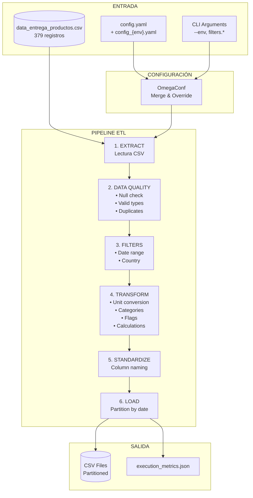
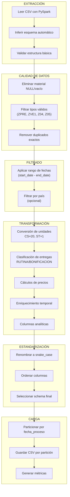
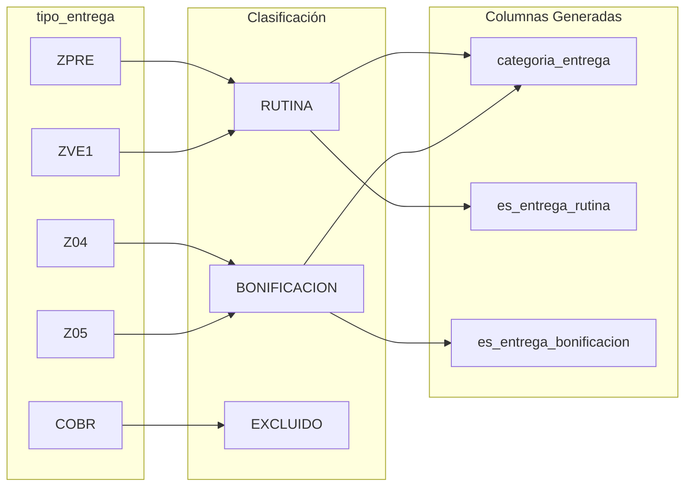
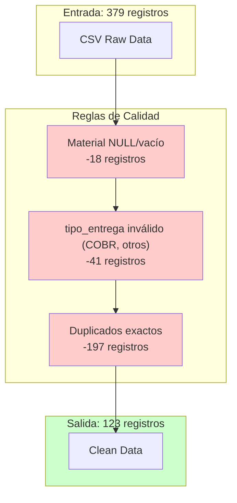
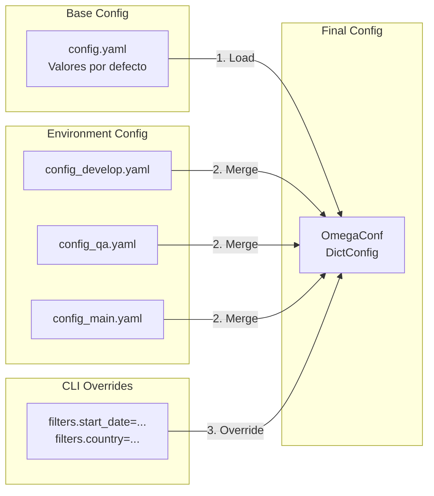

# Diagrama de Flujo de Datos - ETL Entregas de Productos

##  Índice
1. [Arquitectura General](#arquitectura-general)
2. [Diagrama de Alto Nivel](#diagrama-de-alto-nivel)
3. [Pipeline ETL Detallado](#pipeline-etl-detallado)
4. [Transformaciones de Datos](#transformaciones-de-datos)
5. [Calidad de Datos](#calidad-de-datos)
6. [Columnas Adicionales con Fundamento](#columnas-adicionales-con-fundamento)
7. [Configuración OmegaConf](#configuración-omegaconf)
8. [Estructura de Salida](#estructura-de-salida)

---

## Arquitectura General

```
┌─────────────────────────────────────────────────────────────────────────────────┐
│                        ETL ENTREGAS DE PRODUCTOS v1.0                           │
├─────────────────────────────────────────────────────────────────────────────────┤
│                                                                                 │
│  ┌──────────────┐    ┌─────────────────┐    ┌────────────────────────────────┐ │
│  │   FUENTES    │    │    PROCESOS     │    │           DESTINOS             │ │
│  ├──────────────┤    ├─────────────────┤    ├────────────────────────────────┤ │
│  │              │    │                 │    │                                │ │
│  │  CSV Input   │───▶│  PySpark ETL    │───▶│  CSV Particionado por fecha    │ │
│  │              │    │                 │    │                                │ │
│  │  YAML Config │───▶│  OmegaConf      │───▶│  Métricas de Ejecución         │ │
│  │              │    │                 │    │                                │ │
│  │  CLI Args    │───▶│  Data Quality   │───▶│  Logs de Procesamiento         │ │
│  │              │    │                 │    │                                │ │
│  └──────────────┘    └─────────────────┘    └────────────────────────────────┘ │
│                                                                                 │
└─────────────────────────────────────────────────────────────────────────────────┘
```

---

## Diagrama de Alto Nivel



---

## Pipeline ETL Detallado



---

## Transformaciones de Datos

### Conversión de Unidades

```
┌─────────────────────────────────────────────────────────────────┐
│                    CONVERSIÓN DE UNIDADES                       │
├─────────────────────────────────────────────────────────────────┤
│                                                                 │
│   ENTRADA                    FÓRMULA                 SALIDA     │
│   ────────                   ───────                 ──────     │
│                                                                 │
│   cantidad: 5       ×        factor: 20     =       100         │
│   unidad: CS                 (Caja)                 unidades    │
│                                                                 │
│   cantidad: 10      ×        factor: 1      =       10          │
│   unidad: ST                 (Unidad)               unidades    │
│                                                                 │
├─────────────────────────────────────────────────────────────────┤
│   cantidad_unidades = cantidad × CASE(unidad: CS→20, ST→1)      │
└─────────────────────────────────────────────────────────────────┘
```

### Clasificación de Entregas



---

## Calidad de Datos



### Métricas de Calidad

| Métrica | Valor | Descripción |
|---------|-------|-------------|
| registros_iniciales | 379 | Total de registros en CSV original |
| registros_null_material | 18 | Eliminados por código de material vacío |
| registros_tipo_invalido | 41 | Excluidos por tipo_entrega no válido |
| registros_duplicados | 197 | Removidos por ser duplicados exactos |
| registros_finales | 123 | Registros válidos procesados |

---

## Columnas Adicionales con Fundamento

###  Columnas Analíticas Agregadas

| Columna | Tipo | Fundamento de Negocio |
|---------|------|----------------------|
| `dia_proceso` | Integer | Permite análisis de patrones diarios de entrega |
| `dia_semana` | Integer | Identifica concentración de entregas por día (1-7) |
| `nombre_dia_semana` | String | Facilita reportes legibles (Lunes, Martes...) |
| `semana_del_anio` | Integer | Esencial para reportes semanales y comparativos YoY |
| `trimestre` | Integer | Fundamental para reportes financieros trimestrales |
| `periodo_mes` | String | Identifica patrones de inicio/fin de mes (metas, facturación) |
| `rango_volumen` | String | Categoriza entregas para planificación de capacidad |
| `es_alto_valor` | Boolean | Identifica entregas que requieren atención especial |
| `codigo_region` | String | Permite análisis geográfico por zona |
| `precio_por_unidad` | Double | Costo real por unidad individual (normalizado) |
| `es_bonificacion_gratuita` | Boolean | Identifica productos entregados sin costo |

### Diagrama de Columnas Enriquecidas

```
┌──────────────────────────────────────────────────────────────────────────────┐
│                      ENRIQUECIMIENTO TEMPORAL                                │
├──────────────────────────────────────────────────────────────────────────────┤
│                                                                              │
│   fecha_proceso: "20250325"                                                  │
│          │                                                                   │
│          ├──▶ anio_proceso: 2025                                            │
│          ├──▶ trimestre: 1                                                  │
│          ├──▶ mes_proceso: 3                                                │
│          ├──▶ semana_del_anio: 13                                           │
│          ├──▶ dia_proceso: 25                                               │
│          ├──▶ dia_semana: 3 (Martes)                                        │
│          ├──▶ nombre_dia_semana: "Martes"                                   │
│          └──▶ periodo_mes: "FIN_MES" (día >= 21)                            │
│                                                                              │
└──────────────────────────────────────────────────────────────────────────────┘

┌──────────────────────────────────────────────────────────────────────────────┐
│                      CATEGORIZACIÓN DE VOLUMEN                               │
├──────────────────────────────────────────────────────────────────────────────┤
│                                                                              │
│   cantidad_unidades ──▶ rango_volumen                                       │
│                                                                              │
│   ├── 0-20 unidades    ──▶ "BAJO"                                           │
│   ├── 21-100 unidades  ──▶ "MEDIO"                                          │
│   ├── 101-500 unidades ──▶ "ALTO"                                           │
│   └── 500+ unidades    ──▶ "MUY_ALTO"                                       │
│                                                                              │
└──────────────────────────────────────────────────────────────────────────────┘

┌──────────────────────────────────────────────────────────────────────────────┐
│                      INDICADORES DE VALOR                                    │
├──────────────────────────────────────────────────────────────────────────────┤
│                                                                              │
│   precio_total > 1000  ──▶ es_alto_valor: TRUE                              │
│   precio = 0           ──▶ es_bonificacion_gratuita: TRUE                   │
│                                                                              │
└──────────────────────────────────────────────────────────────────────────────┘
```

---

## Configuración OmegaConf



### Jerarquía de Configuración

```
Prioridad (menor a mayor):
━━━━━━━━━━━━━━━━━━━━━━━━━━━
1. config.yaml (base)
     ↓
2. config_{env}.yaml (ambiente)
     ↓
3. CLI arguments (línea de comandos)  ← Máxima prioridad
```

### Ejemplos de Uso

```bash
# Ejecución por defecto (develop)
python main.py

# Ambiente específico
python main.py --env qa
python main.py --env main

# Filtro por fechas
python main.py filters.start_date=20250301 filters.end_date=20250331

# Filtro por país
python main.py filters.country=GT

# Combinación completa
python main.py --env main filters.country=SV filters.start_date=20250201
```

---

## Estructura de Salida

```
data/processed/{environment}/
│
├── fecha_proceso=20250114/
│   └── data.csv                 # 14 registros - Perú
│
├── fecha_proceso=20250217/
│   └── data.csv                 # 18 registros - Ecuador
│
├── fecha_proceso=20250314/
│   └── data.csv                 # 22 registros - Honduras
│
├── fecha_proceso=20250325/
│   └── data.csv                 # 57 registros - El Salvador
│
├── fecha_proceso=20250513/
│   └── data.csv                 # NN registros - Guatemala
│
├── fecha_proceso=20250602/
│   └── data.csv                 # 12 registros - Jamaica
│
└── execution_metrics.json       # Métricas de ejecución
```

### Schema de Salida Final (28 columnas)

```
┌────────────────────────────────────────────────────────────────────────────┐
│                           SCHEMA DE SALIDA                                 │
├────────────────────────────────────────────────────────────────────────────┤
│                                                                            │
│  IDENTIFICADORES GEOGRÁFICOS                                               │
│  ├── codigo_pais (string)          - Código ISO del país (GT, SV, HN...)  │
│  ├── nombre_pais (string)          - Nombre completo del país             │
│  └── codigo_region (string)        - Código de región (2 primeros chars)  │
│                                                                            │
│  IDENTIFICADORES TEMPORALES                                                │
│  ├── fecha_proceso (string)        - Fecha en formato YYYYMMDD            │
│  ├── anio_proceso (int)            - Año de proceso                       │
│  ├── trimestre (int)               - Trimestre (1-4)                      │
│  ├── mes_proceso (int)             - Mes de proceso (1-12)                │
│  ├── semana_del_anio (int)         - Semana del año (1-52)                │
│  ├── dia_proceso (int)             - Día del mes (1-31)                   │
│  ├── dia_semana (int)              - Día de la semana (1-7)               │
│  ├── nombre_dia_semana (string)    - Nombre del día                       │
│  └── periodo_mes (string)          - INICIO_MES/MEDIADOS_MES/FIN_MES      │
│                                                                            │
│  IDENTIFICADORES DE TRANSPORTE                                             │
│  ├── id_transporte (string)        - ID del transporte                    │
│  └── id_ruta (string)              - ID de la ruta                        │
│                                                                            │
│  PRODUCTO                                                                  │
│  └── codigo_material (string)      - Código del material/producto         │
│                                                                            │
│  TIPO DE ENTREGA                                                           │
│  ├── codigo_tipo_entrega (string)  - Código original (ZPRE, ZVE1...)      │
│  ├── categoria_entrega (string)    - RUTINA o BONIFICACION                │
│  ├── es_entrega_rutina (boolean)   - Flag para entregas de rutina         │
│  └── es_entrega_bonificacion (bool)- Flag para bonificaciones             │
│                                                                            │
│  CANTIDADES                                                                │
│  ├── cantidad_original (double)    - Cantidad en unidad original          │
│  ├── unidad_original (string)      - Unidad original (CS o ST)            │
│  ├── cantidad_unidades (double)    - Cantidad normalizada a unidades      │
│  └── rango_volumen (string)        - BAJO/MEDIO/ALTO/MUY_ALTO             │
│                                                                            │
│  PRECIOS E INDICADORES DE VALOR                                            │
│  ├── precio_unitario (double)      - Precio unitario original             │
│  ├── precio_por_unidad (double)    - Precio real por unidad individual    │
│  ├── precio_total (double)         - Precio × cantidad_unidades           │
│  ├── es_bonificacion_gratuita (bool)- TRUE si precio = 0                  │
│  └── es_alto_valor (boolean)       - TRUE si precio_total > 1000          │
│                                                                            │
│  METADATA                                                                  │
│  └── fecha_procesamiento_etl (timestamp) - Momento de ejecución del ETL   │
│                                                                            │
└────────────────────────────────────────────────────────────────────────────┘
```

---

## Métricas de Ejecución

El archivo `execution_metrics.json` contiene:

```json
{
  "status": "SUCCESS",
  "environment": "develop",
  "execution_time_seconds": 87.19,
  "timestamp": "2025-12-09T22:23:14",
  "filters_applied": {
    "start_date": "20250101",
    "end_date": "20250630",
    "country": null
  },
  "quality_metrics": {
    "registros_iniciales": 379,
    "registros_null_material": 18,
    "registros_duplicados": 197,
    "registros_tipo_invalido": 41,
    "registros_finales": 123
  },
  "output_info": {
    "output_path": "data/processed/develop",
    "partitions_created": 6,
    "dates": ["20250114", "20250217", "20250314", "20250325", "20250513", "20250602"]
  }
}
```

---

## Casos de Uso Analíticos

Las columnas adicionales permiten responder preguntas de negocio como:

1. **¿Qué días de la semana tienen más entregas?**
   - Usar: `dia_semana`, `nombre_dia_semana`

2. **¿Cómo se distribuyen las entregas a lo largo del mes?**
   - Usar: `periodo_mes` (INICIO/MEDIADOS/FIN)

3. **¿Cuál es el volumen típico por entrega?**
   - Usar: `rango_volumen`

4. **¿Qué porcentaje de entregas son de alto valor?**
   - Usar: `es_alto_valor`

5. **¿Cuántas bonificaciones gratuitas se entregan?**
   - Usar: `es_bonificacion_gratuita`

6. **Comparativa trimestral de entregas:**
   - Usar: `trimestre`, `anio_proceso`

7. **Análisis por región geográfica:**
   - Usar: `codigo_region`, `codigo_pais`
